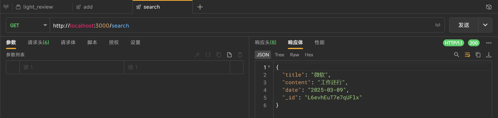
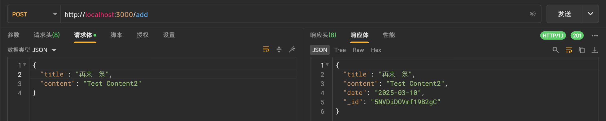

# 项目说明
## 项目介绍
本项目的功能是一个评论系统，用户可以匿名发表评论，也可以看到他人发的评论
项目初衷是希望打工人对公司发表评论，其他打工人在找工作入职某公司的时候，也可以来这个平台搜一搜，提前避坑垃圾公司
当然你也可以把这个项目用于任何其他的地方，总体来说就是一个简易的评论系统
## 项目使用方法
点击中间的卡片可以随机抽一条评论
（但是现在有可能连续抽到同样的卡片）
点击发布按钮发布评论
搜索框中如果有内容，则会根据title搜索评论
搜索框中有内容的时候，中部卡片是搜索的结果
搜索框中有内容的时候，点击中部卡片会从搜索结果中随机抽一条评论
## 搭建与运行
light-review-backend 这个文件夹是后端代码
后端搭建方法：
安装node.js
```
npm install
```
运行：
```
node app.js
```

light-review-frontend 这个文件夹是前端代码
ip.js 中修改后端ip地址
运行：
前端直接用nginx运行即可
## 接口文档
随机抽一条

加评论

从搜索结果中随机抽一条


